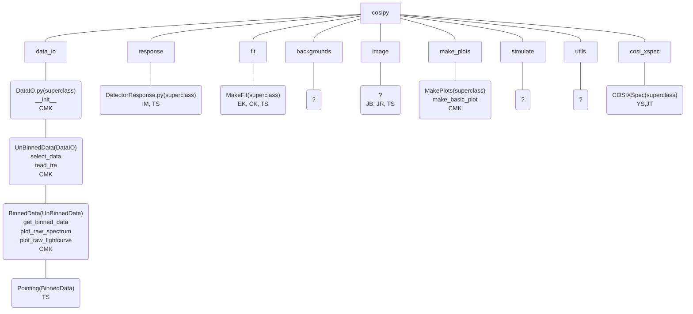

```mermaid
%%{init: {'theme':'default'}}%%
graph TD;
    A[cosipy] --- B[data_io] & C[response] & D[fit] & E[backgrounds] & F[image] & G[make_plots] & H[simulate] & I[utils] & J[cosi_xspec]; 
    B --- Ba("DataIO.py(superclass)"<br>__init__<br>CMK);
    Ba --- Bb("UnBinnedData(DataIO)"<br>select_data<br>read_tra<br>CMK);
    Bb --- Bc("BinnedData(UnBinnedData)" <br>get_binned_data<br>plot_raw_spectrum <br>plot_raw_lightcurve<br>CMK);
    Bc --- Bd("Pointing(BinnedData)"<br>TS);
    C --- Ca("DetectorResponse.py(superclass)"<br>IM, TS);
    D --- Da("MakeFit(superclass)"<br>EK, CK, TS);
    E --- Ea("?");
    F --- Fa("?"<br>JB, JR, TS);
    G --- Ga("MakePlots(superclass)"<br>make_basic_plot<br>CMK);
    H --- Ha("?");
    I --- Ia("?");
    J --- Ja("COSIXSpec(superclass)"<br>YS,JT); 
```
