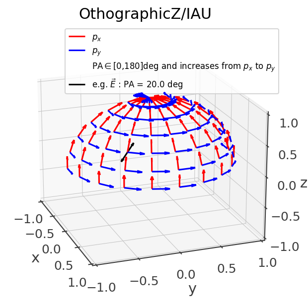
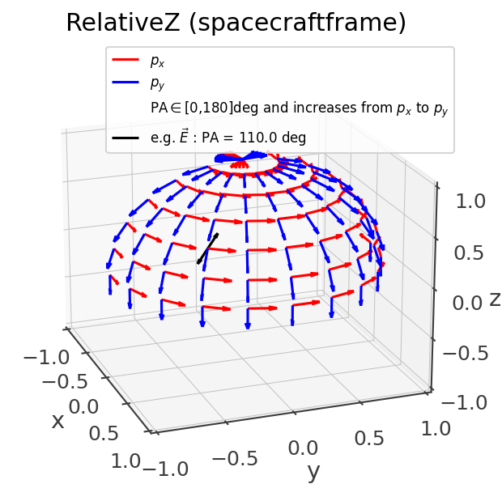
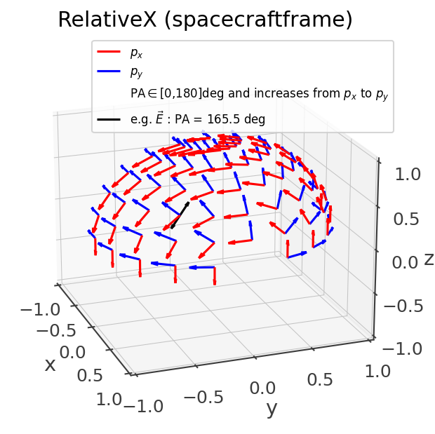
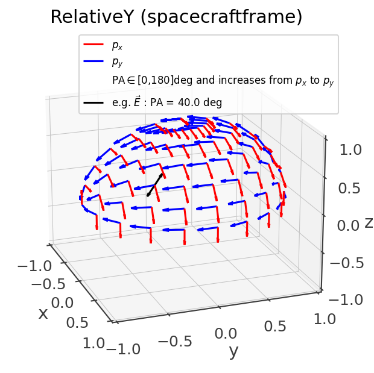
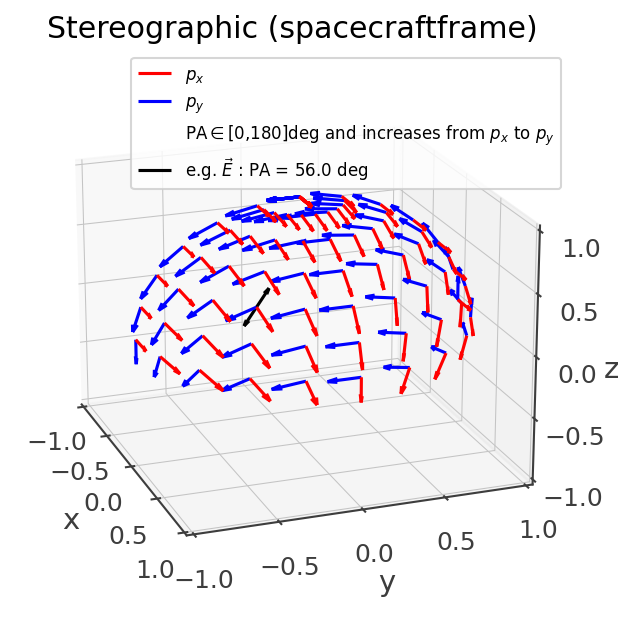

Polarization
============

Conventions
-----------

When specifying a polarization angle (PA) it is important to specify the direction of the source and the convention used. All of this is necessary to reconstruct the polarization vector --i.e. the direction of the electric field.

A polarization convention is defined by a set of (px,py) unit vectors (a basis) that define a plane at each location on the sphere s = [x,y,z]. The location s is always normal to the polarization plane defined by (px,py). The polarization angle increases from px to py.

Cosipy supports two major convention constructions: orthographic and stereographic. These are named after the corresponding conformal projection transformation.

In addition for the overall construction prescription, a polarization convention fully defined by the reference frame and whether the polarization angle increases clockwise or counter-clockwise when looking at the source.

Orthographic
~~~~~~~~~~~~

This the regular polarization convention prescription found in the literature, where the px,py are aligned with the meridians and parallels, and one of them always points towards an arbitrary reference vector. For eample, the following figure corresponds to orthographic convention in ICRS coordinates, pointing towards the North-pole and counter-clockwise when looking at the source (only one quadrant is plotted for easier visualization)::

  OrthographicConvention(ref_vector = SkyCoord(ra = 0*u.deg, dec = 90*u.deg, frame = 'icrs'), clockwise = False)

This matches the `IAU convention <https://www.iau.org/static/resolutions/IAU1973_French.pdf>`_ and can be also called by name::

  PolarizationConvention.get_convention("IAU")

Other special conventions of the orthographic family that can also be called by name are MEGAlibs RelativeX/Y/Z, where the -py vector points towards the reference vector (as opposed to px):

Stereographic
~~~~~~~~~~~~~

An issue of the orthographic projection is that it is not well-defined at the location of the reference vector and its antipodal direction. This can cause issues due to numerical errors when construction a detector response near those locations. The stereographic convention is meant to solve this issue by describing the polarization angle in spacecraft coordinates with only a single undefined location at -z, where the effective area is almost null. Due to the hairy ball theorem it is impossible to obtain a convention where the polarization basis vector have a smooth transition and with undefined locations.

Near the z-axis, it is very similar to using an orthographic convention with +x as the reference vector, and it deviates near and below the equator:

Converting from one convention and/or frame to another
~~~~~~~~~~~~~~~~~~~~~~~~~~~~~~~~~~~~~~~~~~~~~~~~~~~~~~

Use the :code:`transform_to` function::

 pa_inertial =  PolarizationAngle(20*u.deg, source_direction, convention = 'IAU')

 pa2_sc = pa.transform_to('RelativeX', attitude = Attitude.from_rotvec([0,10,0]*u.deg))

 print(pa2_sc.angle.degree)

Results in 161.95. Note that in addition to accounting for the difference polarization reference vector, it also transforms from one reference frame to another on the fly.

.. automodule:: cosipy.polarization
   :imported-members:
   :members:
   :undoc-members:
